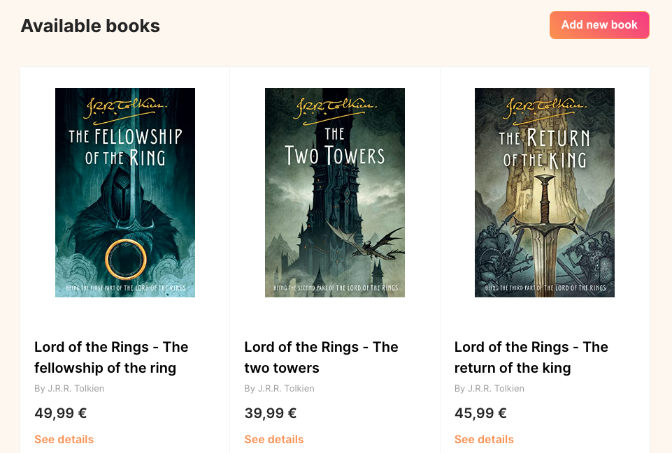
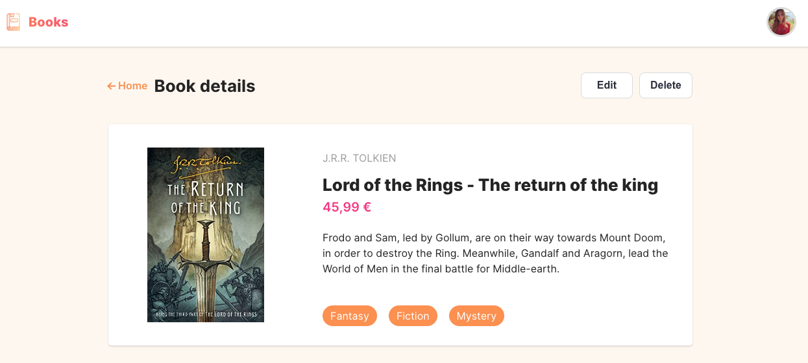
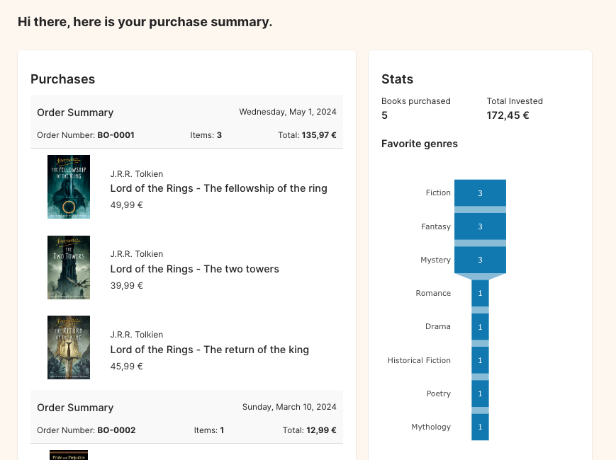

# Zeelo Frontend Candidate Assignment

Assessment that puts into practice a basic frontend development application.

> [!NOTE]  
> - ❤️ Feel free to add any improvements or suggestions you consider.

1. [Goals](#001)
2. [Tech Stack](#002)
3. [Installation and running the project](#003)
4. [Samples](#004)

<a name="001"></a>
### 🎯 Goals

The client should include the following features:

- Show book details, create a new book, edit an existing book, and delete a book.
- Add a “genre” field to the Book entity (with at least 3 genres) and display that information where relevant.
- Implement a new data structure to store purchases and show them in a new Profile page showing the total I have spent on books. You may add or edit new files to support the new domain entities and API methods. Which books a user buys are to be defined at your discretion.
  - Extra (optional): I should be able to see how much I have spent on books grouped by genre.

<a name="002"></a>
### Tech Stack

This test has been developed using the following technologies:

- React, TypeScript, Styled components, Vite.
- JSON-server.
- **Requirements**
  - node@16
  - npm@8.5.0
    
<a name="003"></a>
### Installation and running the project

**Clone the repository:**

```shell
git clone https://github.com/christianjtr/frontend-candidate-assignment-zeelo.git
```

**Scripts:**

```shell
# Run the development environment for the client tier
> npm run dev

# Build the client tier
> npm run build

# Lint the project
> npm run lint

# Run the json-server
> npm run start:json-server

# Run the entire development environment for both client and server tiers
> npm run start
```

<a name="004"></a>
### Samples

##### Home page preview



##### Detail page preview



##### Purchases


